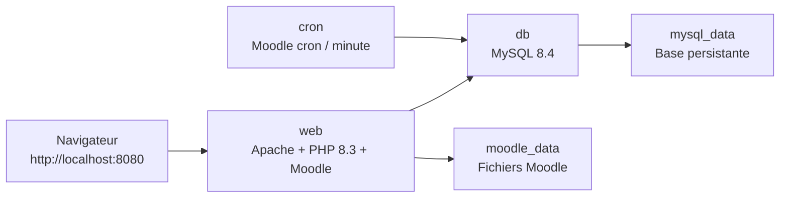

# ISP Niger eLearning

Plateforme Moodle de l’Institut de Santé Publique (ISP) du Niger. Ce dépôt
contient Moodle, les plugins fonctionnels de la plateforme, le thème ISP et
l’environnement Docker permettant de lancer une instance identique en local.

## Stack

| Élément | Technologie |
| --- | --- |
| LMS | Moodle 5.2 |
| Serveur web | Apache, fourni par l’image PHP officielle |
| Runtime | PHP 8.3 (Debian Bookworm) |
| Base de données | MySQL 8.4, encodage `utf8mb4` |
| Dépendances PHP | Composer 2 |
| Orchestration | Docker Compose |
| Tâches planifiées | Conteneur Cron Moodle, toutes les minutes |
| Interface | Thème Moove adapté à la charte ISP |



Le code est monté depuis le répertoire du projet dans le conteneur `web`.
Les données métier restent dans des volumes Docker afin de survivre à
`docker compose down` :

- `mysql_data` : base MySQL ;
- `moodle_data` : fichiers de cours, certificats, logos et autres fichiers
  gérés par Moodle ;
- `composer_vendor` : dépendances PHP installées par Composer.

## Contenu fonctionnel

L’instance configurée comprend notamment :

- interface et langue française ;
- thème Moove aux couleurs ISP, logo officiel et photo ISP pour la connexion ;
- cours de démonstration sur l’intelligence artificielle ;
- suivi de complétion, badges, compétences et plans d’apprentissage ;
- certificats personnalisés avec vérification ;
- activité Attendance et rapports de présence ;
- rapport **Analytique ISP — progression et résultats** ;
- plugin local `report_isplearninganalytics` pour les indicateurs consolidés.

## Prérequis

- Git ;
- Docker Desktop (macOS/Windows) ou Docker Engine avec Docker Compose v2
  (Linux) ;
- au moins 4 Go de mémoire disponible pour Docker.

Vérifiez l’installation :

```sh
git --version
docker --version
docker compose version
```

## Démarrer le projet en local

Clonez la branche de développement et démarrez les services :

```sh
git clone --branch dev https://github.com/Aracom123/moodle-elearning-ilimi.git
cd moodle-elearning-ilimi
docker compose up --build -d
```

Au premier démarrage, l’image construit PHP/Apache, installe les dépendances
Composer et initialise MySQL si aucune base n’est présente. Attendez que les
services soient sains :

```sh
docker compose ps
docker compose logs -f web
```

Ouvrez ensuite <http://localhost:8080>.

Sur une base neuve, le compte administrateur de développement est :

| Champ | Valeur |
| --- | --- |
| Nom d’utilisateur | `admin` |
| Mot de passe | `Admin123!` |

Ces identifiants, comme les mots de passe de MySQL définis dans
`compose.yaml`, sont exclusivement destinés au développement local.

## Appliquer la configuration ISP

Après un démarrage avec une base vide, une restauration de base ou une mise à
jour des plugins, appliquez la configuration idempotente puis vérifiez-la :

```sh
docker compose exec -T web php admin/cli/upgrade.php --non-interactive
docker compose exec -T web php docker/configure-learning-platform.php
docker compose exec -T web php docker/verify-learning-platform.php
```

Le second script est en lecture seule. Une installation correctement
configurée termine actuellement avec `59 contrôles, 0 échec(s)`.

### Création de cours par les enseignants

Le module local `local_ispcoursecreation` donne aux enseignants le seul droit
`moodle/course:create`, dans les catégories contenant un cours où ils ont le
rôle « enseignant éditeur ». Il ne leur donne pas les autres permissions du rôle Moodle
« créateur de cours ». Le droit est ajouté ou retiré automatiquement quand
l’affectation comme enseignant change. Après une restauration de base ou une
importation de rôles réalisée sans événements Moodle, réconciliez les droits :

```sh
docker compose exec -T web php docker/sync-teacher-course-creation.php
```

Le contrôle `docker/smoke-teacher-course-creation.php` vérifie aussi, avec le
compte apprenant de démonstration, que ce droit apparaît lors d’une affectation
enseignante puis disparaît quand celle-ci est retirée.

Le rôle Moodle « enseignant non éditeur » n'est pas utilisé sur cette plateforme.
Pour le retirer d'une installation restaurée, après avoir vérifié qu'aucun
membre du personnel ne le possède encore :

```sh
docker compose exec -T web php docker/remove-nonediting-teacher-role.php
```

Le script refuse la suppression si le rôle est encore attribué à un compte
autre que le compte de test historique ; il conserve ce compte test.

### Certificats ISP

Les deux activités de certificat utilisent un modèle A4 paysage commun : fond
illustré, nom de l’apprenant et du cours renseignés par Moodle, date d’émission,
code unique et QR pointant vers la page de vérification publique de Moodle.
Pour réappliquer ce modèle aux activités existantes :

```sh
docker compose exec -T web php docker/apply-certificate-template.php
```

La signature intégrée est **fictive et ne doit pas être utilisée sur des
certificats officiels**. Remplacez-la uniquement après réception et validation
d’une signature autorisée par l’école. Le QR utilise
`MOODLE_WWWROOT` : sur la production, configurez donc une URL HTTPS publique
avant d’émettre des certificats ; les QR des PDF créés en local pointent vers
`localhost` et ne peuvent pas être vérifiés depuis un autre appareil.

Le tableau de bord analytique est disponible à :

<http://localhost:8080/report/isplearninganalytics/index.php>

## Commandes courantes

```sh
# État des conteneurs.
docker compose ps

# Journaux applicatifs en direct.
docker compose logs -f web

# Lancer le cron une fois manuellement.
docker compose exec -T web php admin/cli/cron.php

# Purger les caches après une modification de thème ou de code.
docker compose exec -T web php admin/cli/purge_caches.php

# Arrêter les conteneurs en conservant la base et les fichiers Moodle.
docker compose down

# Arrêter et supprimer aussi les volumes : perte complète des données locales.
docker compose down -v
```

## Reproduire une instance pour un autre développeur

Le dépôt Git ne contient pas les données Moodle. Pour transmettre une instance
identique, partagez séparément :

1. le code de la branche `dev` ;
2. un export MySQL ;
3. l’archive du répertoire `filedir` de Moodle, qui contient les fichiers
   téléversés et les fichiers associés aux certificats.

Sur la machine source, créez un instantané cohérent :

```sh
docker compose exec -T web php admin/cli/maintenance.php --enable

docker compose exec -T db sh -c 'exec mysqldump --single-transaction --routines --events -uroot -proot elearning_db' \
  > moodle-snapshot.sql

docker compose exec -T web tar -C /var/www/moodledata -czf - filedir \
  > moodle-filedir.tgz

docker compose exec -T web php admin/cli/maintenance.php --disable
```

Ne commitez pas ces archives : elles contiennent des données d’apprenants,
des mots de passe hachés et des fichiers téléversés. Transmettez-les seulement
via un canal privé autorisé.

Sur la machine cible, après le clonage, démarrez uniquement MySQL puis
restaurez l’instantané. Les commandes suivantes détruisent la base locale
`elearning_db` de la machine cible ; ne les exécutez que dans un environnement
de développement neuf ou dont l’écrasement est voulu.

```sh
docker compose up -d db

docker compose exec -T db mysql -uroot -proot -e \
  "DROP DATABASE IF EXISTS elearning_db; CREATE DATABASE elearning_db CHARACTER SET utf8mb4 COLLATE utf8mb4_unicode_ci;"

docker compose exec -T db mysql -uroot -proot elearning_db < ../moodle-snapshot.sql

docker compose up --build -d web
cat ../moodle-filedir.tgz | docker compose exec -T web tar -xzf - -C /var/www/moodledata
docker compose exec -T web chown -R www-data:www-data /var/www/moodledata
docker compose up -d cron

docker compose exec -T web php admin/cli/purge_caches.php
docker compose exec -T web php docker/verify-learning-platform.php
```

## Configuration locale

Les variables Docker principales sont regroupées dans `compose.yaml` :

| Variable | Valeur par défaut | Rôle |
| --- | --- | --- |
| `MOODLE_WWWROOT` | `http://localhost:8080` | URL locale de Moodle |
| `MOODLE_DB_HOST` | `db` | Hôte MySQL dans Docker |
| `MOODLE_DB_NAME` | `elearning_db` | Nom de la base |
| `MOODLE_DB_PREFIX` | `el_` | Préfixe des tables Moodle |
| `MOODLE_ADMIN_USER` | `admin` | Compte créé sur une base vide |

`docker/moodle-entrypoint.sh` génère automatiquement le `config.php` local au
démarrage. Ne versionnez jamais ce fichier généré ni les volumes Docker.

## Déploiement hors développement

Cette configuration Docker est conçue pour le développement local. Avant une
mise en ligne, utilisez des secrets uniques, HTTPS, une URL publique correcte,
des sauvegardes automatisées de MySQL et de `moodledata`, ainsi qu’un stockage
persistant adapté. Ne publiez pas les identifiants fournis dans `compose.yaml`
dans un environnement accessible depuis Internet.

Pour un VPS cPanel où Apache utilise déjà les ports 80 et 443, le fichier
`compose.production.yaml` exécute les conteneurs sur le réseau hôte et lie
MySQL uniquement à `127.0.0.1:3307`. Créez un fichier `.env` privé avec
`MOODLE_WWWROOT`, `MOODLE_DB_PASSWORD`, `MYSQL_ROOT_PASSWORD` et
`MOODLE_ADMIN_PASSWORD` avant d’utiliser cet override. Il impose HTTPS côté
Moodle ; Apache doit rediriger HTTP vers HTTPS et transmettre
`X-Forwarded-Proto: https`.

## Licence

Moodle est distribué sous licence GNU GPL v3. Consultez [COPYING.txt](COPYING.txt)
pour les détails. Les plugins ajoutés conservent leurs licences respectives.
